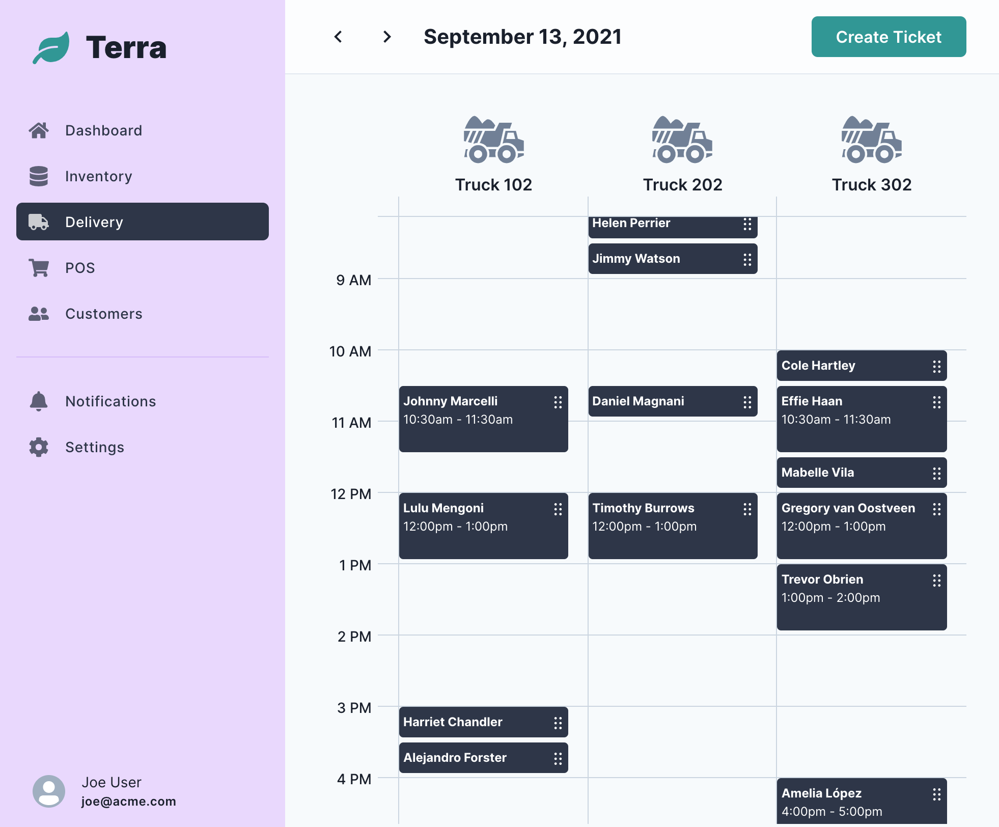

# terra 🌱

A web application for a garden center.

> This project is for demonstration purposes only. It is a work-in-progress.

### [View demo](https://terra-demo.vercel.app/admin/delivery)

## Delivery 🚚

Garden centers may offer delivery of bark yard products. These deliveries are
often scheduled by appointment and billed by travel distance to the customer's
address.

This project is my web-based concept to create and manage delivery orders. The
software solution is primarily intended to eliminate paper-based scheduling
errors.



### Features

> This project is a work-in-progress

- 📅 A calendar view of scheduled deliveries (navigate by day)
- 🤩 Drag-n-drop tickets for easy reschedule (collisions detected!)
- 🕑 Auto generates open time slots to schedule deliveries

### Todo 📋

- [ ] Add Google API to compute travel distance
- [ ] Add authentication
- [ ] ...and 50 more wish list items! 🤪

### Technology

- [TypeScript](https://www.typescriptlang.org/)
- [Next.js](https://nextjs.org/)
- [Chakra UI](https://chakra-ui.com/)
- [MongoDB Atlas](https://www.mongodb.com/cloud/atlas)

Additional libaries of note:

- [React DnD](https://react-dnd.github.io/react-dnd/about)
- [React Query](https://react-query.tanstack.com/)
- [React Hook Form](https://react-hook-form.com/)

## Development

### Prerequisites

- Node >= v14.17.6.
- Yarn v1.22.11 _(optional)_

### Install

First, fork the project to your GitHub account.

```sh
$ git clone https://github.com/[your_github_username]/terra.git
$ cd terra/web
$ yarn # or npm i
```

### Configure

Create a `.env.development.local` with the followng settings.

```
NEXT_PUBLIC_TICKETS_API=/api/tickets
NEXT_PUBLIC_SCHEDULE_API=/api/schedule

NEXT_PUBLIC_SCHEDULE_START_HOUR_IN_24HR = 8
NEXT_PUBLIC_SCHEDULE_END_HOUR_IN_24HR = 18
NEXT_PUBLIC_SCHEDULE_TIME_BLOCK_IN_MINUTES = 30

DB_USER=
DB_PASS=
DB_NAME=
DB_PATH=
```

#### MongoDB

Terra uses MongoDB. Provide connection credentials to the following variables.

- `DB_USER` - db user name
- `DB_PASS` - db user's password
- `DB_NAME` - db name
- `DB_PATH` - the [connection string](https://docs.mongodb.com/manual/reference/connection-string/) to db

### Database

Terra includes a simple cli to load default data.

#### Usage

```
  Usage: yarn db --load=<collection> [options]

  Options:
    --date=<date>   Date on tickets. Use format 'yyyy-M-dd'. (default=today)
    --key=<key>     New vehicle key to add.
    --bulk=<count>  Number of days from '--date' to add tickets. (default=0)
    --drop          Drop collection. (default=false)
    -h, --help      Show this help message.

  Notes:
    1. You must set DOTENV_CONFIG_PATH to a '.env.*' file.

  Examples:
    $ export DOTENV_CONFIG_PATH=./.env.development.local

    // remove all tickets. add new tickets for 2021-9-31
    $ yarn db --load=tickets --date=2021-9-31 --drop

    // adds tickets for today
    $ yarn db --load=tickets

    // adds tickets for the next 20 days (from today)
    $ yarn db --load=tickets --bulk=20

    // reload default vehicles + vehicle 103
    $ yarn db --load=vehicles --key=103 --drop
```

### Run the app

> Make sure you're in the `terra/web` folder.

```sh
# development
$ yarn dev

or...

# build & run
$ yarn build
$ yarn start
```

Then, navigate to `http://localhost:3000/admin/delivery`.

## Author

- [David Valles](https://dtjv.io)

## License

[MIT License](LICENSE)
