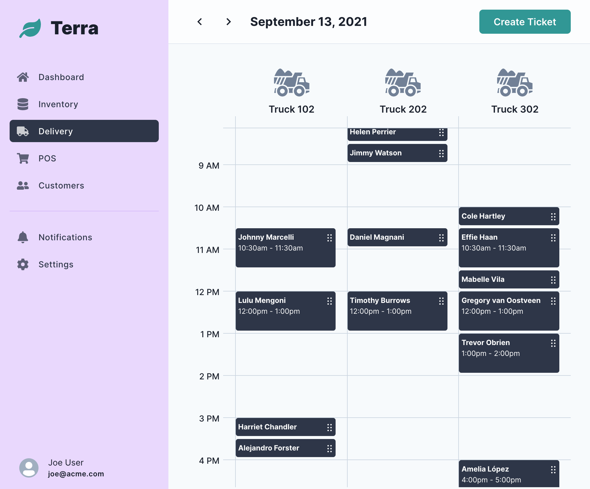

# terra 🌱

A web application for a garden center.

> This project is for demonstration purposes only. It is a work-in-progress.

## Delivery 🚚

Garden centers may offer delivery of bark yard products. These deliveries are
often scheduled by appointment and billed by travel distance to the customer's
address.

This project is my web-based concept to create and manage delivery orders. The
software solution is primarily intended to eliminate paper-based scheduling
errors.

### Features

> This project is a work-in-progress

- 📅 A calendar view of scheduled deliveries (navigate by day)
- 🤩 Drag-n-drop tickets for easy reschedule (collisions detected!)
- 🕑 Auto generates open time slots to schedule deliveries

### Todo 📋

- [ ] Add Google API to compute travel distance
- [ ] Add authentication
- [ ] ...and 50 more wish list items! 🤪

### Technology

- [TypeScript](https://www.typescriptlang.org/)
- [Next.js](https://nextjs.org/)
- [Chakra UI](https://chakra-ui.com/)
- [MongoDB Atlas](https://www.mongodb.com/cloud/atlas)

Additional libaries of note:

- [React DnD](https://react-dnd.github.io/react-dnd/about)
- [React Query](https://react-query.tanstack.com/)
- [React Hook Form](https://react-hook-form.com/)

## Author

- [David Valles](https://dtjv.io)

## License

[MIT License](LICENSE)
